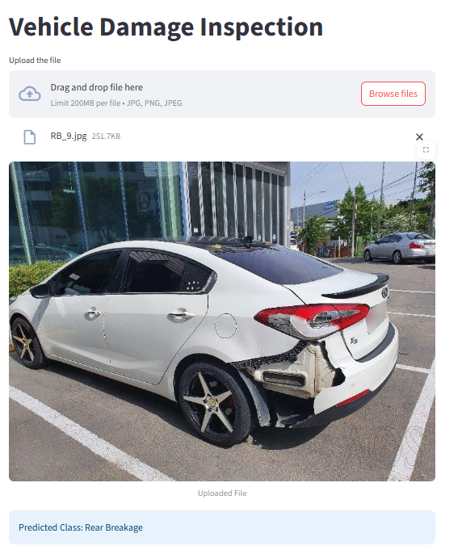

# 🚗 Vehicle Damage Inspection App

The **Vehicle Damage Inspection App** is an AI-powered system that automatically detects and classifies car damages from uploaded images. Designed for insurance, rental, and automotive industries, it helps speed up damage assessment, reduce human error, and improve customer experience.

---

## 🖼️ App Screenshot

<p align="center">
  
</p>

---

## 💼 Business Use Case

In the automotive and insurance industries, manual vehicle inspections are time-consuming, subjective, and expensive. This project automates vehicle damage assessment by using deep learning to:

- Detect damages from images of cars
- Classify the **type** of damage
- Support faster insurance claim processing
- Enable self-service damage checks for customers
- Reduce fraud and inconsistencies in damage reporting

> ✅ Use Cases:
> - **Insurance**: Auto-assess claims with image uploads  
> - **Car Rentals**: Quick pre-/post-rental inspections  
> - **Used Car Marketplaces**: Verifiable vehicle condition reporting  
> - **Fleet Management**: Automated damage tracking across vehicles

---

## 📸 Image Requirements

The model is trained on images from:
- **Third-quarter front view**
- **Rear view**

📷 Make sure the uploaded image clearly shows either of these angles for accurate predictions.

---

## 🧠 Model Architecture

- **Model:** Transfer Learning with **ResNet50**
- **Training Dataset Size:** ~1,700 images
- **Classes:**
  1. Front Normal  
  2. Front Crushed  
  3. Front Breakage  
  4. Rear Normal  
  5. Rear Crushed  
  6. Rear Breakage
- **Validation Accuracy:** ~80%

The model uses pre-trained weights on ImageNet and is fine-tuned on a custom car damage dataset.

---

## 🧰 Tech Stack

| Component         | Technology            |
|------------------|------------------------|
| Frontend         | Streamlit              |
| Backend API      | FastAPI                |
| Model Framework  | PyTorch / torchvision  |
| Training & Tools | Jupyter Notebook       |
| Deployment Ready | ✅ Local, ☁️ Cloud (optional) |

---

## 🚀 Features

- 📂 Drag-and-drop image upload  
- 🧠 Damage type classification (6 classes)  
- 📊 Real-time prediction results  
- 🔌 FastAPI backend for model inference  
- 📷 Works best on specified angles  
- 🧪 Modular training pipeline

---

## 🛠 Setup Instructions

### 🔧 Step 1: Install Dependencies

```bash
pip install -r requirements.txt
```

### ▶️ Step 2: Run Streamlit App

```bash
cd "Streamlit app"
streamlit run app.py
```

### 🔁 (Optional) Step 3: Run FastAPI Backend

```bash
cd ../fastapi
fastapi dev server.py
```

---

